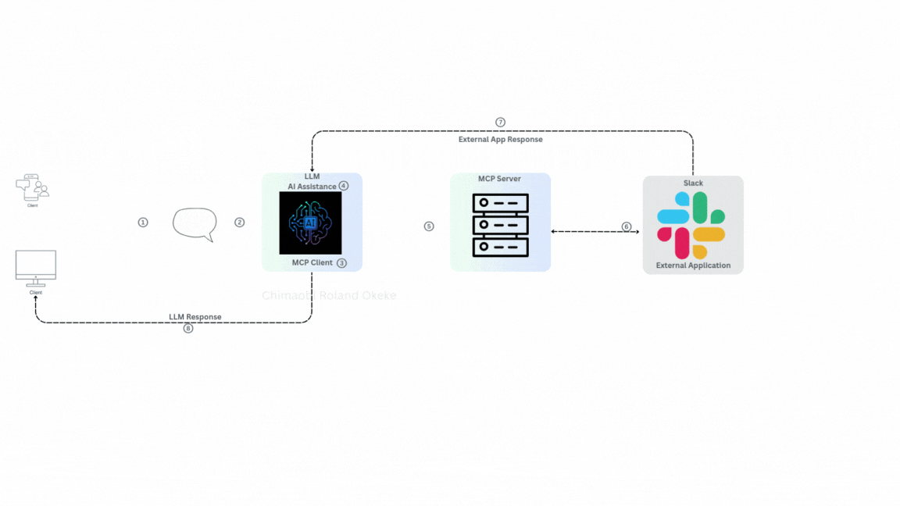
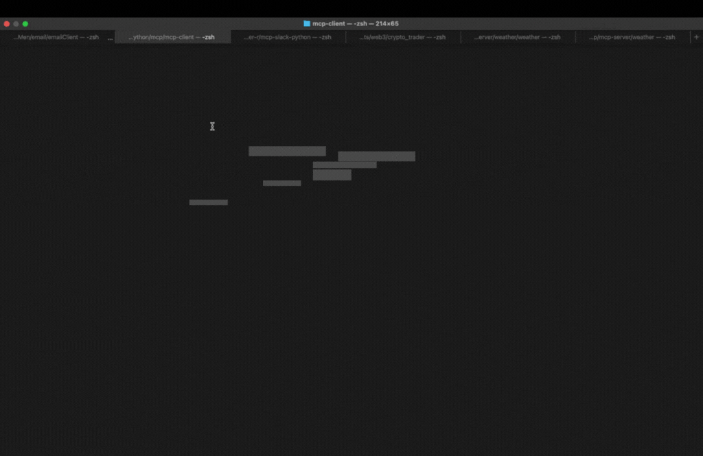

# Slack + ChatGPT Summary Bot using MCP

This step-by-step guide (with complete code) walks you through building a Slack bot that connects to ChatGPT via an MCP server. The bot can summarize hundreds of messages in any Slack channel it's added to. It also detects the dominant emotional tone and provides the total number of messages sent.


---

## ✨ Features

- 🔗 Connects Slack to ChatGPT using an MCP server.
- 🧠 Summarizes messages with context awareness.
- 😃 Notes the dominant emotional tone.
- 🧮 Counts total messages sent in the channel.
- 🔁 Runs on a customizable interval.

---

## 🧰 What is MCP?

**MCP** (Model Context Protocol) is an open protocol by **Anthropic** designed for easy integration between tools, external data sources, and even multiple LLMs.  
Think of MCP as a **universal travel power adapter** — it lets you plug into any context stream or platform effortlessly.

---

## 📦 Setup Instructions

### 1. Clone the Repository

```bash
git clone git@github.com:ORC-1/mcp-chatgpt-slack-bot.git
```

### 2. Create Virtual Environment

```bash
virtualenv env --python=python3.11
source env/bin/activate
```

### 3. Install Dependencies

```bash
pip install -r requirements.txt
```

### 4. Create a Slack Bot

Follow the steps in this guide to get your `SLACK_BOT_TOKEN`:  
👉 [Slack Bot Setup Instructions](#) *https://github.com/modelcontextprotocol/servers/tree/main/src/slack*

---

## ✅ Once Setup is Complete

Make sure you have the following ready:

- ✅ `client.py` created
- ✅ Slack bot created and installed in your workspace
- ✅ MCP server running

---

## ▶️ Run the Bot

To start the bot and summarize messages every 600 minutes:

```bash
python client.py 600
```

You can replace `600` with any number of minutes you'd prefer the bot to wait before performing the next summary.


---

## 💡 Notes

- Ensure your bot has permission to read messages in the channels it's added to.
- Summaries are context-aware and capture emotional sentiment trends over time.

---
